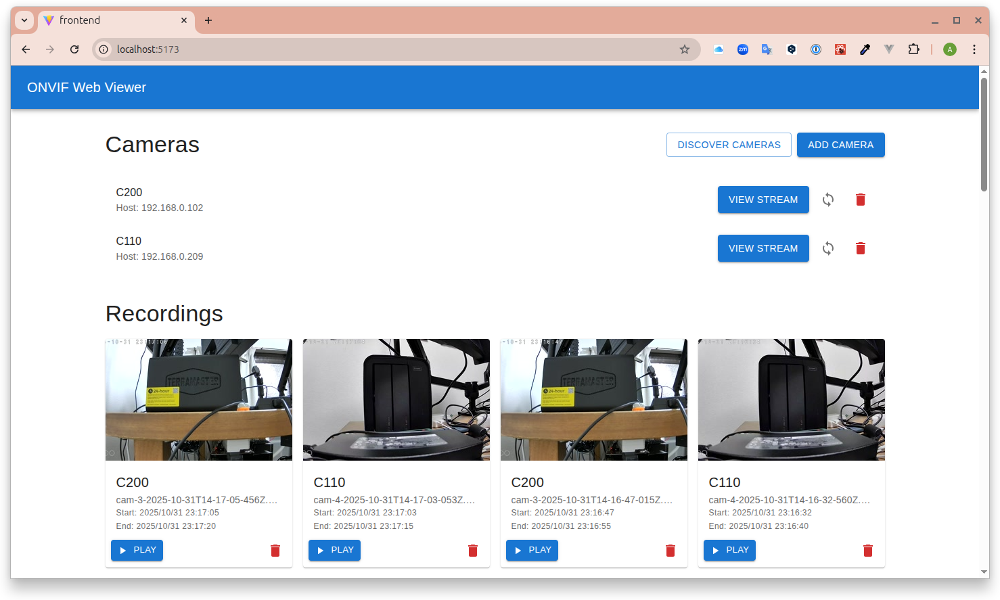
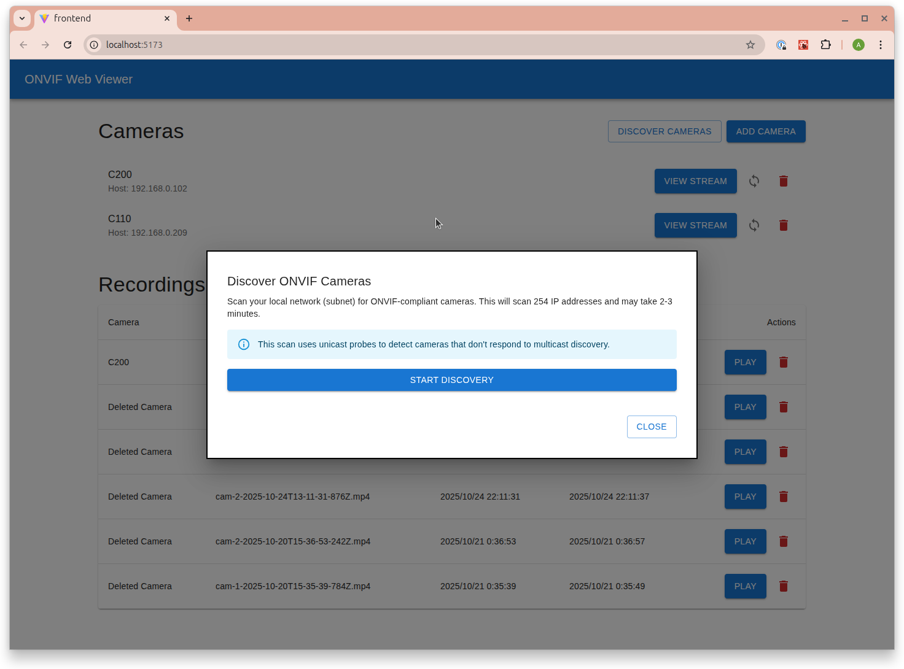
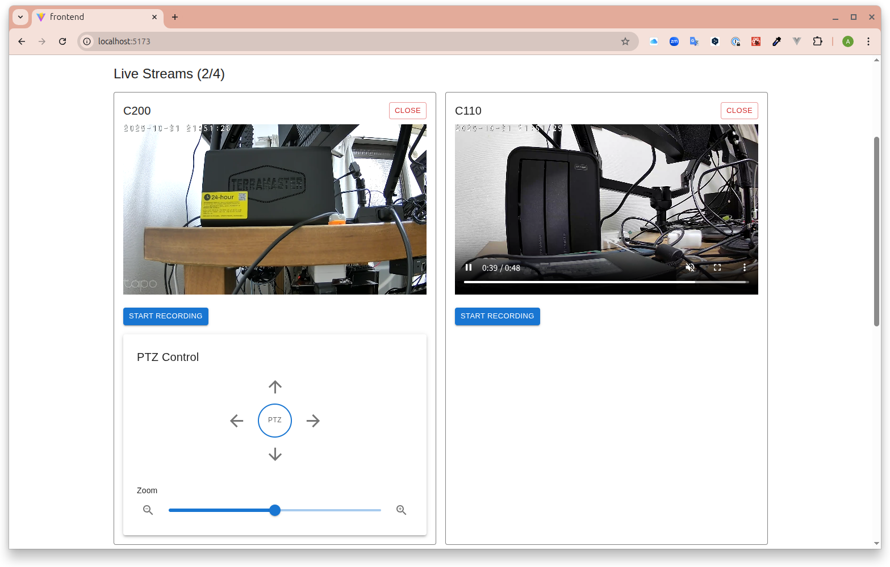

# ONVIF and UVC Camera Web Viewer

This is a full-stack web application designed to manage and view both ONVIF-compliant network cameras and USB UVC (USB Video Class) cameras. The application supports three camera connection modes: direct ONVIF network access, direct UVC V4L2 device access, and UVC cameras via RTSP server. It consists of a Node.js backend and a React frontend.



## Features

*   **Three Camera Connection Modes**:
    *   **ONVIF Network Cameras**: Direct connection to ONVIF-compliant IP cameras via RTSP
    *   **UVC Direct (V4L2)**: Direct access to USB UVC cameras on Linux systems (exclusive device access)
    *   **UVC via RTSP Server**: USB UVC cameras streamed through MediaMTX RTSP server, enabling simultaneous streaming and recording
*   **ONVIF Camera Discovery**: Automatically discover ONVIF cameras on your local network using subnet scanning with unicast WS-Discovery probes.
*   **UVC Camera Discovery**: Automatically detect USB UVC cameras connected to the host system (Linux only, requires V4L2).
*   **Camera Management**: Register, update, delete, and list cameras of all types with visual type indicators (ONVIF, UVC, UVC-RTSP).
*   **Time Synchronization**: Synchronize ONVIF camera time with the server's system time via ONVIF protocol. Cameras are automatically synced when registered, and can be manually synced anytime.
*   **Multi-Camera Live Streaming**: View up to 4 live HLS streams simultaneously in a 2×2 grid layout. Each camera stream operates independently with its own controls. Mix ONVIF and UVC cameras in the same grid.
*   **PTZ Control**: Control Pan-Tilt-Zoom (PTZ) cameras directly from the web interface with intuitive directional controls and zoom slider. PTZ controls are automatically displayed for ONVIF cameras that support the feature.
*   **Independent Recording**: Record video from multiple cameras simultaneously. Each camera has its own recording controls. Auto-generates thumbnails from recordings. Supports both ONVIF and UVC cameras.
*   **Video Playback**: Browse recordings in a 4-column grid with thumbnail previews. Play back recorded MP4 files in a modal player. Recordings from deleted cameras remain accessible.
*   **Connection Testing**: Automatically tests camera connection (ONVIF or UVC device) before saving its details.
*   **Session Persistence**: Active camera streams are automatically restored after page reload.
*   **REST API**: Provides a simple API to interact with the camera data and streaming processes.

## Screenshots

### Camera Discovery

<table>
  <tr>
    <td width="50%"></td>
    <td width="50%"></td>
  </tr>
  <tr>
    <td align="center"><em>Start camera discovery</em></td>
    <td align="center"><em>Scanning network for ONVIF cameras</em></td>
  </tr>
</table>


*List of discovered ONVIF cameras on the network with registration status*

### Live Streaming


*Multi-camera live streaming in 2×2 grid layout - view up to 4 cameras simultaneously with independent controls for each stream*

### PTZ Control


*Pan-Tilt-Zoom controls with directional buttons and zoom slider for PTZ-enabled cameras*

### Recording Playback


*Browse, play, and manage recorded video files with timestamp and camera information*

## Technology Stack

### Backend
*   **Runtime**: [Node.js](https://nodejs.org/)
*   **Framework**: [Express.js](https://expressjs.com/)
*   **Database**: [SQLite3](https://www.sqlite.org/index.html) with [Knex.js](https://knexjs.org/)
*   **ONVIF Protocol**: [onvif](https://www.npmjs.com/package/onvif) for network cameras
*   **UVC Support**: [V4L2 (Video4Linux2)](https://www.kernel.org/doc/html/latest/userspace-api/media/v4l/v4l2.html) for USB cameras (Linux only)
*   **Video Processing**: [FFmpeg](https://ffmpeg.org/) for RTSP/V4L2 to HLS transcoding and MP4 recording
*   **CORS**: [cors](https://www.npmjs.com/package/cors) for handling cross-origin requests.

### Frontend
*   **Framework**: [React](https://reactjs.org/) with [Vite](https://vitejs.dev/)
*   **Language**: [TypeScript](https://www.typescriptlang.org/)
*   **UI Library**: [Material-UI (MUI)](https://mui.com/)
*   **API Client**: [Axios](https://axios-http.com/)
*   **Video Playback**: [hls.js](https://github.com/video-dev/hls.js)

## Project Structure

The project is divided into two main parts:

-   `/backend`: The Node.js/Express server that handles all camera communication and video processing.
-   `/frontend`: The React single-page application that provides the user interface.

## Documentation

-   **[DEPLOYMENT.md](DEPLOYMENT.md)** - Comprehensive guide for building and deploying the application
    -   Development workflow and commands
    -   Production build process
    -   Local testing with `npm run preview`
    -   Deployment instructions for production servers
    -   Nginx configuration examples
    -   Troubleshooting common issues

## Getting Started

### Prerequisites

*   [Node.js](https://nodejs.org/) (v16 or later recommended)
*   [npm](https://www.npmjs.com/)
*   [FFmpeg](https://ffmpeg.org/download.html) must be installed on the machine running the backend server and available in the system's PATH.

**For UVC Camera Support (Optional, Linux only):**
*   V4L2 (Video4Linux2) - Usually included in Linux kernel
*   `v4l-utils` package for device information:
    ```bash
    # Ubuntu/Debian
    sudo apt-get install v4l-utils

    # Fedora/RHEL
    sudo dnf install v4l-utils
    ```
*   User must be in `video` group:
    ```bash
    sudo usermod -a -G video $USER
    # Log out and log back in for changes to take effect
    ```

**For UVC via RTSP Server (Optional, Linux only):**
*   [MediaMTX](https://github.com/bluenviron/mediamtx) RTSP server for streaming UVC cameras
*   Enables simultaneous streaming and recording (not possible with direct V4L2 access due to device exclusivity)
*   Installation:
    ```bash
    # Download latest MediaMTX release
    MEDIAMTX_VERSION=$(curl -s https://api.github.com/repos/bluenviron/mediamtx/releases/latest | grep -oP '"tag_name": "\K(.*)(?=")')
    wget "https://github.com/bluenviron/mediamtx/releases/download/${MEDIAMTX_VERSION}/mediamtx_${MEDIAMTX_VERSION}_linux_amd64.tar.gz"
    tar -xzf mediamtx_${MEDIAMTX_VERSION}_linux_amd64.tar.gz
    sudo mv mediamtx /usr/local/bin/
    sudo chmod +x /usr/local/bin/mediamtx
    ```
*   Configuration example (`mediamtx.yml`):
    ```yaml
    rtspAddress: :8554

    paths:
      uvc_camera_1:
        runOnInit: >
          ffmpeg -f v4l2 -input_format mjpeg -video_size 1280x720 -framerate 30
          -i /dev/video0 -c:v libx264 -preset ultrafast -an
          -f rtsp rtsp://localhost:$RTSP_PORT/$MTX_PATH
        runOnInitRestart: yes
    ```
*   Run MediaMTX:
    ```bash
    /usr/local/bin/mediamtx /path/to/mediamtx.yml
    ```

**Platform Compatibility:**
| Feature | Linux | Windows | macOS |
|---------|-------|---------|-------|
| ONVIF Cameras | ✅ | ✅ | ✅ |
| UVC Direct (V4L2) | ✅ | ❌ | ❌ |
| UVC via RTSP Server | ✅ | ❌ | ❌ |

### Installation & Running

You need to run both the backend and frontend servers in separate terminals for the application to work.

**1. Backend Server:**

```sh
# Navigate to the backend directory
cd backend

# Install dependencies
npm install

# Run database migrations (first time setup)
npx knex migrate:latest

# Run the development server
npm run dev
```
The backend will be running at `http://localhost:3001`.

### Database Setup (Knex.js)

The backend uses [Knex.js](https://knexjs.org/) as a SQL query builder and migration tool with SQLite3.

**Database Configuration:**
- Database file: `backend/src/db/dev.sqlite3` (auto-created on first migration)
- Configuration file: `backend/knexfile.js`
- Migrations directory: `backend/src/db/migrations/`

**Available Migrations:**
- `20251015144534_create_cameras_table.js` - Creates the `cameras` table
- `20251016140916_add_xaddr_to_cameras.js` - Adds `xaddr` column for custom ONVIF URLs
- `20251018120100_create_recordings_table.js` - Creates the `recordings` table
- `20251031131841_add_thumbnail_to_recordings.js` - Adds `thumbnail` column for recording preview images
- `20251102000000_add_camera_types.js` - Adds camera type support (ONVIF/UVC) and device path field
- `20251103000000_add_uvc_rtsp_camera_type.js` - Adds UVC_RTSP camera type for UVC cameras via RTSP server

**Common Knex Commands:**

```sh
cd backend

# Run all pending migrations
npx knex migrate:latest

# Rollback the last batch of migrations
npx knex migrate:rollback

# Check migration status
npx knex migrate:status

# Create a new migration file
npx knex migrate:make migration_name
```

**Database Schema:**

*cameras* table:
- `id` (primary key, auto-increment)
- `name` (text) - Camera display name
- `type` (text) - Camera type: 'onvif', 'uvc', or 'uvc_rtsp'
- `host` (text, nullable) - IP address or hostname (ONVIF and UVC_RTSP)
- `port` (integer, nullable) - Port number (ONVIF: default 80, UVC_RTSP: default 8554)
- `user` (text, nullable) - Username for authentication (ONVIF and UVC_RTSP, optional)
- `pass` (text, nullable) - Password for authentication (ONVIF and UVC_RTSP, optional)
- `xaddr` (text, nullable) - Custom ONVIF device service URL (ONVIF only)
- `device_path` (text, nullable) - Device path (UVC Direct only, e.g., /dev/video0)
- `stream_path` (text, nullable) - RTSP stream path (UVC_RTSP only, default: /uvc_camera_1)

*recordings* table:
- `id` (primary key, auto-increment)
- `camera_id` (integer, foreign key) - Reference to cameras table
- `filename` (text) - MP4 filename
- `thumbnail` (text, nullable) - Thumbnail image filename (JPG)
- `start_time` (datetime) - Recording start timestamp
- `end_time` (datetime, nullable) - Recording end timestamp
- `is_finished` (boolean, default: false) - Recording completion status

**2. Frontend Server:**

```sh
# From the project root, navigate to the frontend directory
cd frontend

# Install dependencies
npm install

# Run the development server
npm run dev

# Build for production
npm run build

# Preview production build
npm run preview
```
The frontend development server will be running at `http://localhost:5173` and should open automatically in your browser.

**Frontend Build Commands:**
- `npm run dev` - Start Vite development server with hot module replacement (HMR)
- `npm run build` - Build for production (runs TypeScript compiler + Vite build). Output goes to `dist/` directory
- `npm run lint` - Run ESLint to check code quality
- `npm run preview` - Preview the production build locally

## Usage

Once the application is running, you can manage your cameras through the web interface.

*   **Discovering ONVIF Cameras**: Click the "Discover Cameras" button to automatically scan your local network for ONVIF cameras. The scan will probe each IP address in your subnet and may take 2-3 minutes.
    *   Discovered cameras that are already registered will be marked as "Registered".
    *   You can add unregistered cameras by providing their credentials. The discovery window will remain open, allowing you to add multiple cameras without re-scanning.
*   **Adding a Camera Manually**: Click the "Add Camera" button to open a dialog.
    *   **ONVIF Camera**: Select "ONVIF Network Camera" type and enter camera details (Name, Host/IP, Port, Username, Password). The system tests the connection before adding the camera. After successful registration, the camera's time is automatically synchronized with the server.
    *   **UVC Camera Direct (Linux only)**: Select "USB UVC Camera" type, click "Discover USB Cameras" to scan for connected devices, then select a device from the dropdown. The system verifies device accessibility before adding. Note: Direct V4L2 access means only one process can use the device at a time (streaming OR recording, not both simultaneously).
    *   **UVC Camera via RTSP Server (Linux only)**: Select "UVC via RTSP Server" type and enter RTSP server details (Name, Host/IP, Port, optional Username/Password). This requires MediaMTX or another RTSP server to be running and configured to stream from the UVC device. Benefits: allows simultaneous streaming and recording, and lower CPU usage compared to direct V4L2 access.
*   **Synchronizing Camera Time**: Click the sync icon (⟳) next to any ONVIF camera in the list to manually synchronize its time with the server's system time. A notification will confirm success or display any errors. (Note: Time synchronization is only available for ONVIF cameras, not UVC cameras.)
*   **Deleting a Camera**: Click the red delete icon (🗑️) next to a camera in the main list. A confirmation prompt will appear before deletion.
*   **Viewing Multiple Streams**:
    *   Click the "View Stream" button next to a camera to add it to the grid view.
    *   You can view up to 4 cameras simultaneously in a 2×2 grid layout.
    *   Each camera stream has its own controls and operates independently.
    *   Click "Stop Stream" in the camera list or the "Close" button in the grid to remove a camera from view.
    *   If you try to add a 5th camera, you'll receive an alert indicating the maximum limit has been reached.
    *   Active streams are saved in session storage and will be automatically restored when you refresh the page.
*   **PTZ Control**: For cameras that support PTZ (Pan-Tilt-Zoom), a control panel will automatically appear below the video player for each camera.
    *   Use the directional arrow buttons (↑ ↓ ← →) to pan and tilt the camera. Press and hold to move; release to stop.
    *   Use the zoom slider or +/- buttons to zoom in and out. The camera will automatically stop zooming when you release the control.
    *   All PTZ controls support both mouse and touch input for mobile devices.
    *   Each camera's PTZ controls operate independently.
*   **Recording**: Each camera stream has its own "Start Recording" and "Stop Recording" buttons.
    *   You can record from multiple cameras simultaneously.
    *   The recording status (REC indicator) is displayed for each camera independently.
    *   Recordings are saved as MP4 files on the server.
    *   When a recording is stopped, a thumbnail is automatically generated from the video (captured at the 2-second mark).
    *   New recordings appear immediately in the recordings list after stopping (no page reload required).
*   **Playback & Management**: Completed recordings are displayed in a 4-column grid layout with thumbnail previews.
    *   Each recording card shows: thumbnail image, camera name, filename, and start/end timestamps.
    *   Click the "Play" button to watch a recording in a modal player.
    *   Recordings from deleted cameras will be labeled accordingly and remain playable.
    *   Click the red delete icon (🗑️) to permanently delete a recording. A confirmation prompt will appear before deletion. This will remove both the database record, the MP4 file, and the thumbnail from the server.

## API Reference

The backend provides the following REST API endpoints for programmatic access or debugging.

#### `GET /api/cameras`
Retrieves a list of all registered cameras.

#### `GET /api/cameras/discover`
Discovers ONVIF cameras on the local network using subnet scanning. This endpoint performs unicast WS-Discovery probes to each IP address in the subnet (default: 192.168.0.1-254). The scan typically takes 2-3 minutes to complete.

**Query Parameters** (optional):
- `subnet`: Subnet base address (e.g., `192.168.1`)
- `start`: Starting IP address (e.g., `1`)
- `end`: Ending IP address (e.g., `254`)

**Response**: Returns an array of discovered devices with their IP addresses, ports, device names, and ONVIF service URLs.

#### `POST /api/cameras`
Registers a new camera. Tests the camera connection (ONVIF or UVC) before saving.

**ONVIF Camera Request Body**:
```json
{
  "type": "onvif",
  "name": "Front Door Camera",
  "host": "192.168.1.100",
  "port": 80,
  "user": "admin",
  "pass": "password",
  "xaddr": "http://192.168.1.100:8080/onvif/device_service" // Optional
}
```

**UVC Camera (Direct V4L2) Request Body**:
```json
{
  "type": "uvc",
  "name": "USB Webcam",
  "device_path": "/dev/video0"
}
```

**UVC Camera (via RTSP Server) Request Body**:
```json
{
  "type": "uvc_rtsp",
  "name": "USB Camera via MediaMTX",
  "host": "localhost",
  "port": 8554,
  "user": "optional_username",     // Optional
  "pass": "optional_password",     // Optional
  "stream_path": "/uvc_camera_1"  // Optional, defaults to /uvc_camera_1
}
```

#### `PUT /api/cameras/:id`
Updates an existing camera's information. Useful for adding or correcting details like the `xaddr`.
**Example Body**: `{ "xaddr": "http://192.168.1.100:8080/onvif/device_service" }`

#### `DELETE /api/cameras/:id`
Deletes a registered camera from the database.

#### `GET /api/cameras/uvc/discover`
Discovers USB UVC cameras connected to the host system (Linux only). Scans /dev/video* devices and retrieves device information.

**Response Example**:
```json
{
  "devices": [
    {
      "device_path": "/dev/video0",
      "name": "HD Pro Webcam C920",
      "type": "uvc"
    },
    {
      "device_path": "/dev/video2",
      "name": "UVC Camera /dev/video2",
      "type": "uvc"
    }
  ]
}
```

**Note**: Requires V4L2 support and appropriate user permissions (user must be in `video` group).

#### `GET /api/cameras/:id/capabilities`
Retrieves the capabilities of a specific camera. Different camera types support different features.

**Response Example**:
```json
{
  "streaming": true,
  "recording": true,
  "thumbnails": true,
  "ptz": true,              // ONVIF only
  "discovery": true,         // ONVIF only
  "timeSync": true,          // ONVIF only
  "remoteAccess": true       // ONVIF only
}
```

For UVC cameras, `ptz`, `discovery`, `timeSync`, and `remoteAccess` will be `false`.

#### `POST /api/cameras/:id/stream/start`
Starts the FFmpeg process to convert the camera's stream to HLS. Works for all camera types:
- **ONVIF**: RTSP input with `-c:v copy` (no re-encoding, low CPU usage)
- **UVC Direct**: V4L2 input with libx264 encoding (higher CPU usage)
- **UVC_RTSP**: RTSP input with libx264 re-encoding for proper keyframes

Returns the relative URL of the HLS playlist (e.g., `/streams/1/index.m3u8`).

#### `POST /api/cameras/:id/stream/stop`
Stops the FFmpeg process for the specified camera.

#### `POST /api/cameras/:id/recording/start`
Starts a new recording for the specified camera. Works for all camera types:
- **ONVIF**: RTSP to MP4 with `-c:v copy` (low CPU)
- **UVC Direct**: V4L2 to MP4 with libx264 encoding (higher CPU, exclusive device access)
- **UVC_RTSP**: RTSP to MP4 with `-c:v copy` (low CPU, allows simultaneous streaming)

The video is saved as an MP4 file on the server.

**Note**: For UVC Direct cameras, streaming and recording cannot run simultaneously due to V4L2 device exclusivity. Use UVC_RTSP mode to enable simultaneous operations.

#### `POST /api/cameras/:id/recording/stop`
Stops an in-progress recording and finalizes the MP4 file. Automatically generates a thumbnail from the recording.

#### `GET /api/cameras/:id/time` (ONVIF only)
Retrieves the current date and time from the specified ONVIF camera, along with the server's current time for comparison.

**Response Example**:
```json
{
  "cameraTime": { /* ONVIF date/time object */ },
  "serverTime": "2025-01-24T12:00:00.000Z"
}
```

**Note**: This endpoint only works with ONVIF cameras. UVC cameras do not support remote time retrieval.

#### `POST /api/cameras/:id/sync-time` (ONVIF only)
Synchronizes the specified ONVIF camera's system time with the server's current time using ONVIF's `SetSystemDateAndTime` method. The time is set in UTC format.

**Response Example**:
```json
{
  "success": true,
  "beforeTime": { /* ONVIF date/time object before sync */ },
  "serverTime": "2025-01-24T12:00:00.000Z",
  "message": "Camera time synchronized successfully"
}
```

**Note**: This endpoint only works with ONVIF cameras. The camera's time is synchronized to the server's system time. Ensure the server has accurate time (e.g., via NTP) for proper synchronization.

#### `GET /api/cameras/:id/ptz/capabilities` (ONVIF only)
Checks if the specified ONVIF camera supports PTZ (Pan-Tilt-Zoom) functionality.

**Response Example**:
```json
{
  "supported": true,
  "capabilities": {
    "hasPanTilt": true,
    "hasZoom": true
  }
}
```

If PTZ is not supported, `supported` will be `false` and `capabilities` will be `null`.

**Note**: This endpoint only works with ONVIF cameras. UVC cameras do not support PTZ functionality.

#### `POST /api/cameras/:id/ptz/move` (ONVIF only)
Moves the ONVIF camera using continuous PTZ movement. The camera will continue moving in the specified direction until a stop command is sent.

**Request Body**:
```json
{
  "x": 0.5,        // Pan speed: -1.0 (left) to 1.0 (right), 0 = no movement
  "y": 0.3,        // Tilt speed: -1.0 (down) to 1.0 (up), 0 = no movement
  "zoom": 0.2,     // Zoom speed: -1.0 (out) to 1.0 (in), 0 = no movement
  "timeout": 1000  // Optional: auto-stop after N milliseconds
}
```

**Response**:
```json
{
  "success": true,
  "message": "Camera movement started"
}
```

**Note**: Values represent movement speed/direction. Use 0.5 for moderate speed, 1.0 for maximum speed.

#### `POST /api/cameras/:id/ptz/stop` (ONVIF only)
Stops all ongoing PTZ movements (pan, tilt, and zoom) for the specified ONVIF camera.

**Request Body** (optional):
```json
{
  "panTilt": true,  // Stop pan/tilt movement (default: true)
  "zoom": true      // Stop zoom movement (default: true)
}
```

**Response**:
```json
{
  "success": true,
  "message": "Camera movement stopped"
}
```

#### `GET /api/recordings`
Retrieves a list of all completed recordings, including camera name and file details. Recordings from deleted cameras are included.

#### `DELETE /api/recordings/:id`
Deletes a recording by its ID. This removes both the database record and the associated MP4 file from the server's filesystem.

**Response**: Returns `204 No Content` on success.

**Error Handling**:
- If the recording ID is not found, returns `404 Not Found`
- If the file cannot be deleted but exists in the database, the database record is still removed to prevent orphaned records
